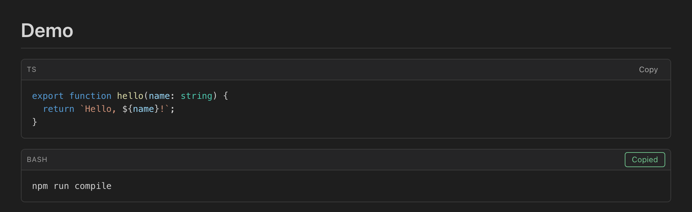

# Markdown Code Copy

A tiny, **zero-dependency** VS Code extension that adds a GitHub-style **Copy** button to
every fenced code block in the built-in Markdown Preview — complete with a language label
and a clear "Copied" confirmation.



## Features

- 📋 **One-click copy** on every fenced code block in the Markdown Preview.
- 🏷️ **Language label** taken from the fence info string (`ts`, `bash`, …).
- ✅ **Clear feedback** — an affirmative "Copied" state, with a graceful "Failed" fallback.
- 🎨 **Theme-aware** — styled entirely with VS Code theme variables, so it fits light, dark,
  and high-contrast themes.
- 🪶 **Zero runtime dependencies** — copies the exact, unmodified source of the block.
- 🔁 **Reliable** — a single delegated listener handles many blocks and survives preview
  re-renders.

## Install

### From a packaged `.vsix`

```bash
npm install
npm run package        # produces markdown-code-copy-<version>.vsix
code --install-extension markdown-code-copy-0.1.0.vsix
```

Or in VS Code: **Extensions** view → `···` menu → **Install from VSIX…**

### From source (for development)

```bash
npm install
npm run compile        # or: npm run watch
```

Then press **F5** to launch an Extension Development Host with the extension loaded.

## Usage

1. Open any Markdown file.
2. Open the preview — **Ctrl/Cmd + Shift + V** (or **Ctrl/Cmd + K, V** for a side-by-side
   preview).
3. Each fenced code block gets a header bar with its language and a **Copy** button. Click
   it to copy the block's exact contents; the button briefly shows **Copied**.

Try it with the included [`demo.md`](demo.md).

## How it works

The extension hooks VS Code's Markdown Preview via the
[`extendMarkdownIt`](https://code.visualstudio.com/api/extension-guides/markdown-extension#adding-a-new-syntax)
API (enabled by the `markdown.markdownItPlugins` contribution point). It overrides the
fenced-code renderer to wrap each block in a toolbar, and stores the block's original
source as UTF-8 **base64** on the button. The injected preview script (`media/copy.js`)
decodes that and writes it to the clipboard via the browser Clipboard API.

Base64 sidesteps quote escaping, HTML escaping, and special-character corruption, so what
you copy is byte-for-byte what was in the fence.

## Project structure

```txt
markdown-code-copy/
├─ src/extension.ts   # extendMarkdownIt: wraps each fence, emits the toolbar
├─ media/copy.js      # preview-side: decode base64 + copy to clipboard
├─ media/copy.css     # GitHub-style header bar + button states (theme vars)
├─ demo.md            # sample document
└─ package.json       # contributes markdownItPlugins + previewScripts/Styles
```

## Design constraints

- **No runtime dependencies.** `dependencies` in `package.json` stays empty; the
  preview-side JS/CSS is hand-written, never a bundled library.
- **Performance & reliability first.** The smallest possible script/style is injected, and
  copy is handled by one event-delegated listener rather than per-button handlers or
  polling.

## License

[MIT](LICENSE)
